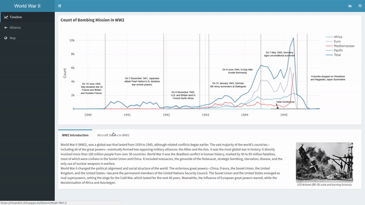

# Visualization of Air Strikes in World War II
Contributors: [Zhengjie Xu](https://github.com/zhengjxu), [Yiqiang Zhao](https://github.com/YiQ-Zhao) 
## Overview
This is the final project of Data Visualization. As visual communication now is a must-have skill for data scientists, we tried to use dataset [Aerial Bombing Operations in World War II](https://www.kaggle.com/usaf/world-war-ii/data) to practice our ability to deliver a clear visual data narrative. 

In this porject, we wanted to answer the following questions
* How the bombing operations changed over time
* How were important events represented by the bombing operations
* What locations were most likely to become bombing targets
* What were most used aircrafts

The project was mainly built on R language due to its user-friendly and extremely powerful graphing capabilities.  Please visit below links for more details:
- [Web App](https://msan622.shinyapps.io/dataviz/)
- [Video Intro](https://www.youtube.com/watch?v=nAYnC-hhqis&feature=youtu.be)

## Demo
